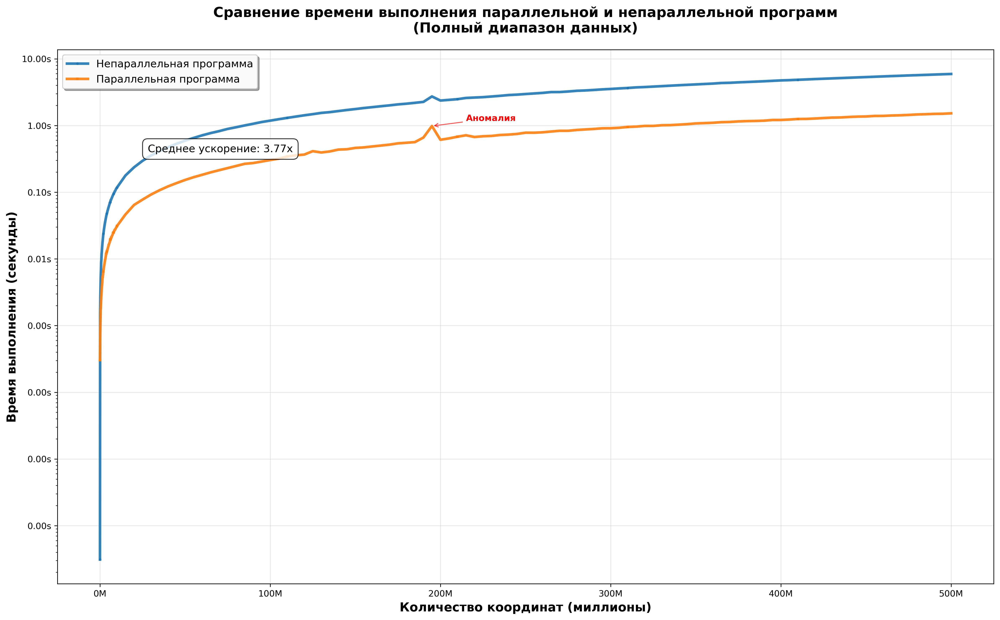
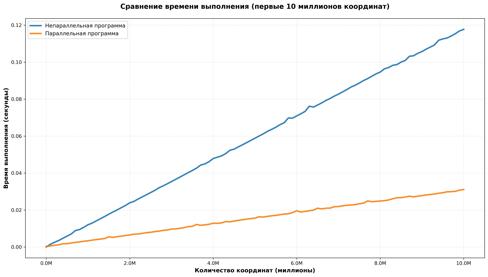
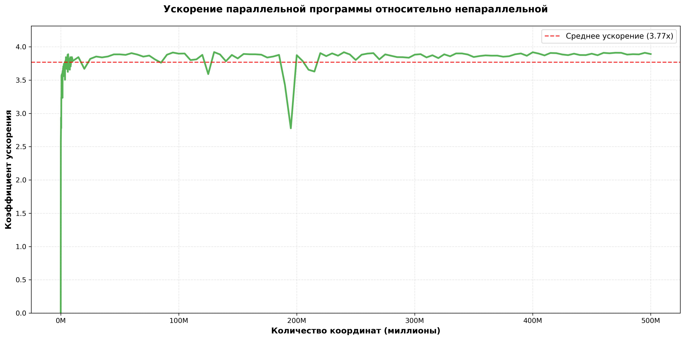

# Задача

Реализовать программу на языке C/C++, вычисляющую площадь простого многоугольника (без самопересечений) по заданному списку координат его вершин. Требуется предоставить две версии: 
- Однопоточную реализацию  
- Многопоточную реализацию с использованием OpenMP

В основе вычислений лежит формула площади Гаусса (также известная как «формула шнуровки»). Алгоритм имеет линейную сложность $O(n)$  и идеально подходит для распараллеливания, так как суммирование может быть выполнено по частям.
<br><br>
# Требования
CMake с версией не меньше 3.11
<br><br>
# Компиляция и запуск
```bash
cmake -S ./ -B build/ -DCMAKE_BUILD_TYPE=Release
cmake --build build/
```

Запуск проекта:
```bash
cd build/
./polygon_area
```
Запуск google-тестов:
```bash
cd build/
./google_test
run_e2e.sh
```
Запуск end2end-тестов:
```bash
cd results/
bash ./run_e2e.sh
```
Вывод подробной статистики:
```bash
cd results/
python3 statistics.py
```
<br><br>
# Проведённое исследование
1) Генерация тестовых данных: создание многоугольников с различным количеством вершин (от 0 до 500 миллионов).
2) Измерение времени работы обеих реализаций
3) Анализ ускорения, полученного за счет параллелизации
<br><br>
# Ключевые результаты
1) Производительность
    - Среднее ускорение: 3.72x
    - Максимальное ускорение достигается на больших объемах данных
    - Ускорение остается стабильным при увеличении количества вершин

2) Зависимость от объема данных
    - Малые наборы данных (до 1 млн вершин): незначительное ускорение из-за накладных расходов на создание потоков
    - Средние наборы данных (1-100 млн вершин): оптимальное ускорение
    - Большие наборы данных (свыше 100 млн вершин): стабильное высокое ускорение

3) Аномалии:
    - В ходе тестирования выявлены отдельные аномальные точки (например, при 195 млн вершин), где производительность параллельной версии временно снижалась, что может быть связано либо с перераспределением нагрузки между потоками, либо с влиянием кэширования процессора.



