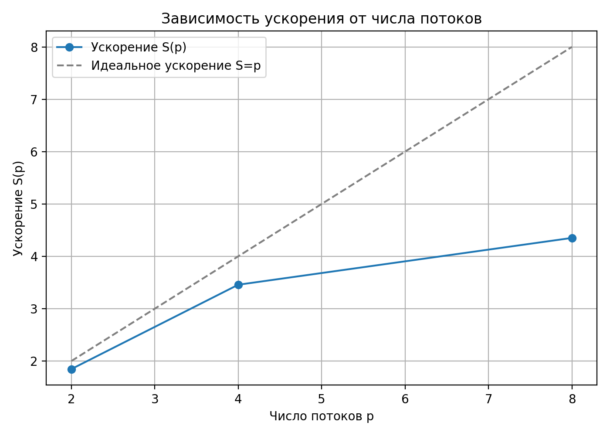
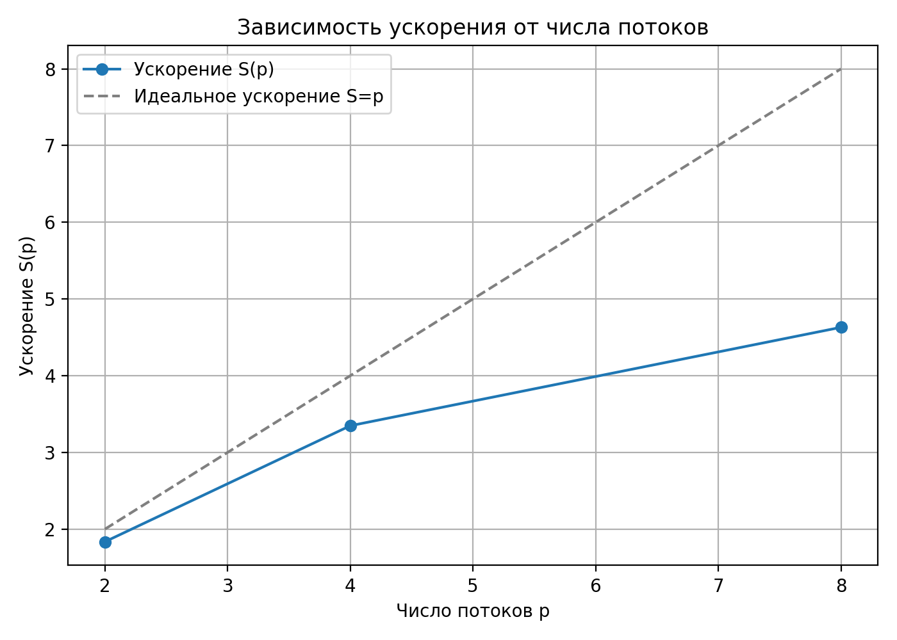

# Эффективное распараллеливание циклов

Создать параллельные реализации эталонной программы, а также двух индивидуальных вариантов программы.

В случае, когда распараллеливание возможно несколькими методами, выбрать наиболее эффективный вариант. Параллельная и последовательная реализации должны генерировать одинаковый выходной файл.

## Распараллеливание эталонной программы

Рассмотрим вложенный цикл из программы в файле `./src/reference.c`:
```cpp
for (i = 0; i < ISIZE; i++) {
  for (j = 0; j < JSIZE; j++)
    a[i][j] = sin(2 * a[i][j]);
}
```

**1. Определим вектор направлений:**

В каждой итерации обращение к массиву происходит к ячейке с индексом `(i, j)`:
1) Запись `S1`: `A[f(i, j)] = ...` с `f(i, j) = (i, j)`.
2) Чтение `S2`: `... = A[g(i, j)]` с `g(i, j) = (i, j)`.

Условие зависимости возникает, если существует пара итераций $\Lambda = (\lambda_i,\ \lambda_j)$ и $K = (\kappa_i,\ \kappa_j)$ такие, что 

$$F(\Lambda) = G(K).$$

В нашем случае это уравнение равенства пар индексов:

$$(\lambda_i,\ \lambda_j) = (\kappa_i,\ \kappa_j).$$

А значит, что для каждой компоненты расстояние

$$D_n = \lambda_n - \kappa_n = 0.$$

Итого, вектор направлений:

$$\boxed{d = ("=",\ "=")}.$$

<br>

**2. Определим вектор расстояний:**

Как вычислили выше, для любой найденной зависимости $\Lambda = K$ получаем:

$$\boxed{D = (0,\ 0)},$$

то есть расстояние зависимости по `i` и по `j` равно `0`.
<br><br>

**3. Тип зависимости и варианты распараллеливания:**

Выше мы получили, что расстояние зависимости `D = (0, 0)`. То есть, на самом деле, это антизависимость, то есть такая зависимость, которая не связана с наличием цикла — `loop independent dependence`.

Зависимость сконцентрирована в пределах одной итерации. Возможно параллельное исполнение различных итераций.

Теперь распараллелим этот вложенный цикл (по обеим уровням вложенности) с помощью `OpenMP` (см. файл `reference.par.c`).
<br><br>

**4. Результаты:**

Теперь мы можем сравнить последовательную и параллельную реализации:
```cpp
Sequential time: 0.201979 seconds

Parallel time: 0.037910 seconds    // Ускорили в 6.5 раз. 
```
<br>

Также построим график зависимости коэффициента ускорения от числа исполнителей для каждого из написанных вариантов программы:


<br><br>

## Распараллеливание программы из варианта `1а`
Рассмотрим вложенный цикл из программы в файле `./src/variant_1a.c`:
```cpp
for (i = 1; i < ISIZE; i++) {
  for (j = 0; j < JSIZE - 1; j++)
    a[i][j] = sin(2 * a[i - 1][j + 1]);
}
```

Здесь каждая операция присваивания:

$$S(i,\ j):\ \ a[i][j] = \sin(2 ⋅ a[i−1][j+1])$$

использует данные из предыдущей строки массива `(i-1)` и со следующего столбца `(j+1)`.


**1. Определим вектор расстояний:**

В каждой итерации обращение к массиву происходит к ячейке с индексом `(i, j)`:
1) Запись `S1`: `A[f(i, j)] = ...` с `f(i, j) = (i, j)`.
2) Чтение `S2`: `... = A[g(i, j)]` с `g(i, j) = (i-1, j+1)`.

Условие зависимости возникает, если существует пара итераций $\Lambda = (\lambda_i,\ \lambda_j)$ и $K = (\kappa_i,\ \kappa_j)$ такие, что 

$$F(\Lambda) = G(K).$$

В нашем случае это уравнение равенства пар индексов:

$$(\lambda_i,\ \lambda_j) = (\kappa_i - 1,\ \kappa_j + 1).$$

По определению:

$$D = \Lambda -K = (\lambda_i - \kappa_i,\ \lambda_j - \kappa_j).$$

Подставляем выражения, найденные выше:

$$D = ((\kappa_i - 1) - \kappa_i,\ (\kappa_j + 1) - \kappa_j) = (1,\ -1).$$

Итак:

$$\boxed{D = (1,\ -1)}.$$

Также вектор направлений:

$$\boxed{d = ("<",\ ">")}.$$

<br>

**3. Тип зависимости и варианты распараллеливания:**

Поскольку первая компонента вектора направлений равна `"<"`, то зависимость является истинной (`true dependence`).

Это означает, что итерация `(i, j)` использует данные, вычисленные на предыдущей итерации `(i-1, j+1)`. По внешнему циклу нет возможности распараллеливания ($D_i > 0$). Но есть возможность распараллеливания по внутреннему циклу, так как имеет место антизависимость ($D_j < 0$).

Можно безопасно применить распараллеливание по внутреннему циклу с помощью `OpenMP` (см. файл `variant_1a.par.c`).
<br><br>

**4. Результаты:**

Теперь мы можем сравнить последовательную и параллельную реализации:
```cpp
Sequential time: 0.185915 seconds

Parallel time: 0.043907 seconds    // Ускорили в 4.5 раз. 
```
<br>

Также построим график зависимости коэффициента ускорения от числа исполнителей для каждого из написанных вариантов программы:


<br><br>


## Распараллеливание программы из варианта `3а`
Рассмотрим вложенный цикл из программы в файле `./src/variant_3a.c`:
```cpp
for (i = 1; i < ISIZE; i++) {
  for (j = 0; j < JSIZE - 1; j++)
    a[i][j] = sin(2 * a[i - 1][j + 1]);
}
```

Здесь каждая операция присваивания:

$$S(i,\ j):\ \ a[i][j] = \sin(2 ⋅ a[i−1][j+1])$$

использует данные из предыдущей строки массива `(i-1)` и со следующего столбца `(j+1)`.


**1. Определим вектор расстояний:**

В каждой итерации обращение к массиву происходит к ячейке с индексом `(i, j)`:
1) Запись `S1`: `A[f(i, j)] = ...` с `f(i, j) = (i, j)`.
2) Чтение `S2`: `... = A[g(i, j)]` с `g(i, j) = (i-1, j+1)`.

Условие зависимости возникает, если существует пара итераций $\Lambda = (\lambda_i,\ \lambda_j)$ и $K = (\kappa_i,\ \kappa_j)$ такие, что

$$F(\Lambda) = G(K).$$

В нашем случае это уравнение равенства пар индексов:

$$(\lambda_i,\ \lambda_j) = (\kappa_i - 1,\ \kappa_j + 1).$$

По определению:

$$D = \Lambda -K = (\lambda_i - \kappa_i,\ \lambda_j - \kappa_j).$$

Подставляем выражения, найденные выше:

$$D = ((\kappa_i - 1) - \kappa_i,\ (\kappa_j + 1) - \kappa_j) = (1,\ -1).$$

Итак:

$$\boxed{D = (1,\ -1)}.$$

Также вектор направлений:

$$\boxed{d = ("<",\ ">")}.$$

<br>

**3. Тип зависимости и варианты распараллеливания:**

Поскольку первая компонента вектора направлений равна `"<"`, то зависимость является истинной (`true dependence`).

Это означает, что итерация `(i, j)` использует данные, вычисленные на предыдущей итерации `(i-1, j+1)`. По внешнему циклу нет возможности распараллеливания ($D_i > 0$). Но есть возможность распараллеливания по внутреннему циклу, так как имеет место антизависимость ($D_j < 0$).

Можно безопасно применить распараллеливание по внутреннему циклу с помощью `OpenMP` (см. файл `variant_1a.par.c`).
<br><br>

**4. Результаты:**

Теперь мы можем сравнить последовательную и параллельную реализации:
```cpp
Sequential time: 0.185915 seconds

Parallel time: 0.043907 seconds    // Ускорили в 4.5 раз. 
```
<br>

Также построим график зависимости коэффициента ускорения от числа исполнителей для каждого из написанных вариантов программы:

